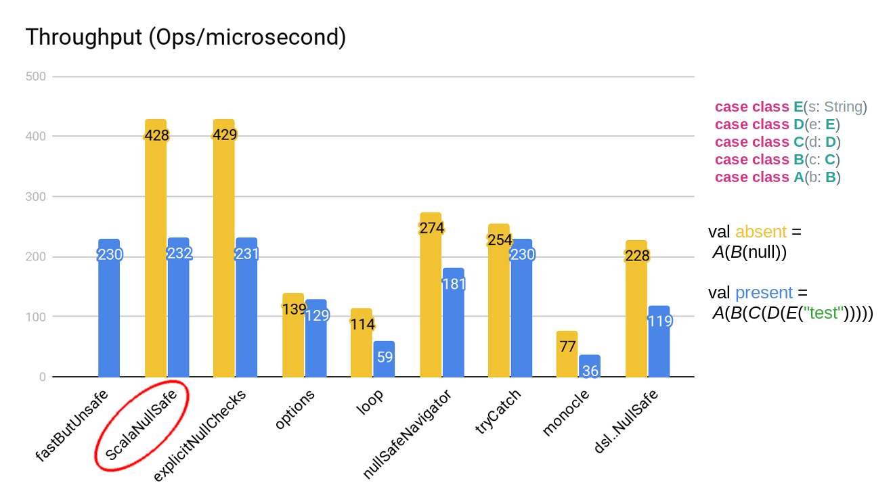

# ScalaNullSafe

The purpose of this library is to provide a quick, easy, readable/writable, and efficient way to do null-safe traversals in Scala.

[](https://github.com/ryanstull/ScalaNullSafe/actions/workflows/test.yml)

### Quick comparison of null-safe implementations:

| Implementation      	                                                                                                                                                                             | Null-safe 	| Readable & Writable | Efficient 	|
|---------------------------------------------------------------------------------------------------------------------------------------------------------------------------------------------------|-----------	|-------------------	|-----------	|
| 🎉 [**ScalaNullSafe**](https://github.com/ryanstull/ScalaNullSafe/blob/e596852bd54fd3848bc9fa91bdee33f4024afde1/benchmarks/src/test/scala/com/ryanstull/nullsafe/Benchmarks.scala#L132) 🎉        | ✔️         	| ✔️                 	| ✔️         	|
| [Normal access](https://github.com/ryanstull/ScalaNullSafe/blob/e596852bd54fd3848bc9fa91bdee33f4024afde1/benchmarks/src/test/scala/com/ryanstull/nullsafe/Benchmarks.scala#L27)        	          | ⛔         	| ✔️                 	| ✔️         	|
| [Explicit null-checks](https://github.com/ryanstull/ScalaNullSafe/blob/e596852bd54fd3848bc9fa91bdee33f4024afde1/benchmarks/src/test/scala/com/ryanstull/nullsafe/Benchmarks.scala#L30-L45) 	      | ✔️         	| ⛔                 	| ✔️         	|
| [Option flatMap](https://github.com/ryanstull/ScalaNullSafe/blob/e596852bd54fd3848bc9fa91bdee33f4024afde1/benchmarks/src/test/scala/com/ryanstull/nullsafe/Benchmarks.scala#L74-L79)       	      | ✔️         	| ⚠️                 	| ⛔         	|
| [For loop flatMap](https://github.com/ryanstull/ScalaNullSafe/blob/e596852bd54fd3848bc9fa91bdee33f4024afde1/benchmarks/src/test/scala/com/ryanstull/nullsafe/Benchmarks.scala#L82-L90)     	      | ✔️         	| ⚠️                 	| ⛔         	|
| [Null-safe navigator](https://github.com/ryanstull/ScalaNullSafe/blob/e596852bd54fd3848bc9fa91bdee33f4024afde1/benchmarks/src/test/scala/com/ryanstull/nullsafe/Benchmarks.scala#L120-L123)  	    | ✔️         	| ⚠️                 	| ⚠️         	|
| [Try-catch NPE](https://github.com/ryanstull/ScalaNullSafe/blob/e596852bd54fd3848bc9fa91bdee33f4024afde1/benchmarks/src/test/scala/com/ryanstull/nullsafe/Benchmarks.scala#L104-L109)        	    | ✔️         	| ✔️                 	| ⚠️         	|
| [thoughtworks NullSafe DSL](https://github.com/ryanstull/ScalaNullSafe/blob/e596852bd54fd3848bc9fa91bdee33f4024afde1/benchmarks/src/test/scala/com/ryanstull/nullsafe/Benchmarks.scala#L169-L172) | ✔️         	| ✔️	                  | ⚠️         	|
| [Monocle Optional (lenses)](https://github.com/ryanstull/ScalaNullSafe/blob/e596852bd54fd3848bc9fa91bdee33f4024afde1/benchmarks/src/test/scala/com/ryanstull/nullsafe/Benchmarks.scala#L139-L162) | ✔️         	| 💀	                  | 💀         	|

Key: ✔️ = Good, ⚠️ = Sub-optimal, ⛔ = Bad, 💀 = Horrible

## How to use

Add the dependency:

[](https://maven-badges.herokuapp.com/maven-central/com.ryanstull/scalanullsafe_2.13)

```sbt
libraryDependencies += "com.ryanstull" %% "scalanullsafe" % "1.3.0" % "provided"
```
<sub>* Since macros are only used at compile time, if your build tool has a way to specify compile-time-only dependencies, you can use that for this library</sub>

### Example use:

```scala
import com.ryanstull.nullsafe._

case class A(b: B)
case class B(c: C)
case class C(d: D)
case class D(e: E)
case class E(s: String)

val a = A(B(C(null)))
?(a.b.c.d.e.s) //No NPE! Just returns null

val a2 = A(B(C(D(E("Hello")))))
?(a2.b.c.d.e.s) //Returns "Hello"
```

There's also a variant that returns an `Option[A]` when provided an expression of type `A`, 
another that just checks if a property is defined, and it's inverse.

```scala
opt(a.b.c.d.e.s) //Returns None
notNull(a.b.c.d.e.s) //Returns false
isNull(a.b.c.d.e.s) //Returns true

opt(a2.b.c.d.e.s) //Returns Some("Hello")
notNull(a2.b.c.d.e.s) //Returns true
isNull(a2.b.c.d.e.s) //Returns false
```

## How it works

### `?` macro

The macro works by transforming an expression at compile-time, inserting null-checks before each intermediate result is used; turning
`?(a.b.c)`, for example, into:

```scala
if(a != null){
  val b = a.b
  if(b != null){
    b.c
  } else null
} else null
```

Or for a longer example, transforming `?(a.b.c.d.e.s)` into:

```scala
if(a != null){
  val b = a.b
  if(b != null){
    val c = b.c
    if(c != null){
      val d = c.d
      if(d != null){
        val e = d.e
        if(e != null){
          e.s
        } else null
      } else null
    } else null
  } else null
} else null
```

#### Custom default for `?`

For the `?` macro, you can also provide a custom default instead of `null`, by passing it in as the second
parameter.  For example:

```scala
case class Person(name: String)

val person: Person = null

assert(?(person.name,"Jeff") == "Jeff")
```

### `opt` macro

The `opt` macro is very similar, translating `opt(a.b.c)` into:

```scala
if(a != null){
  val b = a.b
  if(b != null){
    Option(b.c)
  } else None
} else None
```

### `notNull` macro

And the `notNull` macro, translating `notNull(a.b.c)` into:

```scala
if(a != null){
  val b = a.b
  if(b != null){
    b.c != null
  } else false
} else false
```

### `isNull` macro

And the `isNull` macro, translating `isNull(a.b.c)` into:

```scala
if(a != null){
  val b = a.b
  if(b != null){
    b.c == null
  } else true
} else true
```

### `??` macro

There's also a `??` ([null coalesce operator](https://en.wikipedia.org/wiki/Null_coalescing_operator)) which is used to select the first non-null value from a var-args list of expressions.

```scala
case class Person(name: String)

val person = Person(null)

assert(??(person.name)("Bob") == "Bob")

val person2: Person = null
val person3 = Person("Sally")

assert(??(person.name,person2.name,person3.name)("No name") == "Sally")
```

The null-safe coalesce operator also rewrites each arg so that it's null safe.  So you can pass in `a.b.c` as an expression
without worrying if `a` or `b` are `null`. 

A simple but accurate way to think about how the `??` macro transforms its arguments would be like this:

```scala
{
    val v1 = ?(arg1)
    if(v1 != null) v1
    else {
        <next> or <default>
    }
}
```

So in the example above we would have:

```scala
{
    val v1 = ?(person.name)
    if (v1 != null) v1
    else {
        val v2 = ?(person2.name)
        if (v2 != null) v2
        else {
            val v3 = ?(person3.name)
            if (v3 != null) v3
            else default
        }
    }
}
```

To be fully explicit, the `??` macro would transform the above example to:

```scala
{
    val v1 = if(person!=null){
        person.name
    } else null
    if(v1 != null) v1
    else {
        val v2 = if(person2!=null) {
            person2.name
        } else null
        if (v2 != null) v2
        else {
            val v3 = if(person3!=null){
                person3.name
            } else null
            if (v3 != null) v3
            else "No name"
        }
    }
}
```

### `??` compared to `?`

Compared to the `?` macro, in the case of a single arg, the `??` macro checks that the _entire_ expression is not null; whereas
the `?` macro would just check that the preceding elements (e.g. `a` and `b` in `a.b.c`) aren't null before returning the default value.

For example consider the following example:

```scala
case class A(b: B)
case class B(c: C)
case class C(s: String)

val a = A(B(C(null)))

assert(?(a.b.c.s, "Default") == null)
assert(??(a.b.c.s)("Default") == "Default")
```

For `?`, the default value only gets used if there would've been a `NullPointerException`.  So the return value of `?` could still be `null` even if you supply a default.

### Safe translation

All of the above work for method invocation as well as property access, and the two can be freely intermixed. For example:

`?(someObj.methodA().field1.twoArgMethod("test",1).otherField)`

will be translated properly.

Also the macros will make the arguments to method and function calls null-safe as well:

`?(a.b.c.method(d.e.f))`

So you don't have to worry if `d` or `e` would be null.

### Efficient null-checks

The macros are also smart about what they check for null; so any intermediate results that are `<: AnyVal` will not be checked for null.  For example:

```scala
case class A(b: B)
case class B(c: C)
case class C(s: String)

?(a.b.c.s.asInstanceOf[String].charAt(2).*(2).toString.getBytes.hashCode())
```

Would be translated to:

```scala
if (a != null)
  {
    val b = a.b;
    if (b != null)
      {
        val c = b.c;
        if (c != null)
          {
            val s = c.s;
            if (s != null)
              {
                val s2 = s.asInstanceOf[String].charAt(2).$times(2).toString();
                if (s2 != null)
                  {
                    val bytes = s2.getBytes();
                    if (bytes != null)
                      bytes.hashCode()
                    else
                      null
                  }
                else
                  null
              }
            else
              null
          }
        else
          null
      }
    else
      null
  }
else
  null
```

## Performance

Here's the result of running the included jmh benchmarks:



```
[info] Benchmark                             Mode  Cnt    Score   Error   Units
[info] Benchmarks.fastButUnsafe             thrpt   20  230.157 ± 0.572  ops/us
[info] Benchmarks.ScalaNullSafeAbsent       thrpt   20  428.124 ± 1.625  ops/us
[info] Benchmarks.ScalaNullSafePresent      thrpt   20  232.066 ± 0.575  ops/us
[info] Benchmarks.explicitSafeAbsent        thrpt   20  429.090 ± 0.842  ops/us
[info] Benchmarks.explicitSafePresent       thrpt   20  231.400 ± 0.660  ops/us
[info] Benchmarks.optionSafeAbsent          thrpt   20  139.369 ± 0.272  ops/us
[info] Benchmarks.optionSafePresent         thrpt   20  129.394 ± 0.102  ops/us
[info] Benchmarks.loopSafeAbsent            thrpt   20  114.330 ± 0.113  ops/us
[info] Benchmarks.loopSafePresent           thrpt   20   59.513 ± 0.097  ops/us
[info] Benchmarks.nullSafeNavigatorAbsent   thrpt   20  274.222 ± 0.441  ops/us
[info] Benchmarks.nullSafeNavigatorPresent  thrpt   20  181.356 ± 1.538  ops/us
[info] Benchmarks.tryCatchSafeAbsent        thrpt   20  254.158 ± 0.686  ops/us
[info] Benchmarks.tryCatchSafePresent       thrpt   20  230.081 ± 0.659  ops/us
[info] Benchmarks.monocleOptionalAbsent     thrpt   20   77.755 ± 0.800  ops/us
[info] Benchmarks.monocleOptionalPresent    thrpt   20   36.446 ± 0.506  ops/us
[info] Benchmarks.nullSafeDslAbsent         thrpt   30  228.660 ± 0.475  ops/us
[info] Benchmarks.nullSafeDslPresent        thrpt   30  119.723 ± 0.506  ops/us
[success] Total time: 3909 s, completed Feb 24, 2019 3:03:02 PM
```

You can find the source code for the JMH benchmarks [here](https://github.com/ryanstull/ScalaNullSafe/blob/ebc0ed592fa5997a9c7b868cf8cdcea590e8ae07/benchmarks/src/test/scala/com/ryanstull/nullsafe/Benchmarks.scala#L18).  If you want to run the benchmarks yourself, just run `sbt bench`, or `sbt quick-bench` for a shorter run. These benchmarks
compare all of the known ways (or at least the ways that I know of) to handle null-safe traversals in scala.

The reason ScalaNullSafe performs the best is because there are no extraneous method calls, memory allocations, or exception handling, which all of the other solutions use.
By leveraging the power of macros we are able to produce theoretically-optimal bytecode, whose performance is equivalent to the explicit null safety approach.

## Why?

Some people have questioned the reason for this library's existence since, in Scala, the idiomatic way to handle potentially absent values is to use `Option[A]`. 
The reason this library is needed is that there are situations where you need to extract deeply nested data, in a null-safe way, that was not defined using `Option[A]`. 
This mostly happens when interoping with Java, but could also occur with any other JVM language.  The original reason this library was created was to simplify a large amount of
code that dealt with extracting values out of highly nested [Avro](https://avro.apache.org/) data structures.

## Notes

* Using the `?` macro on an expression whose type is `<: AnyVal`, will result in returning the corresponding java wrapper
type.  For example `?(a.getInt)` will return `java.lang.Integer` instead of `Int` because the return type for this macro must
be nullable.  The conversions are the default ones defined in `scala.Predef`

* If you're having trouble with resolving the correct method when using the `?` macro with a default arg, try explicitly
specifying the type of the default
